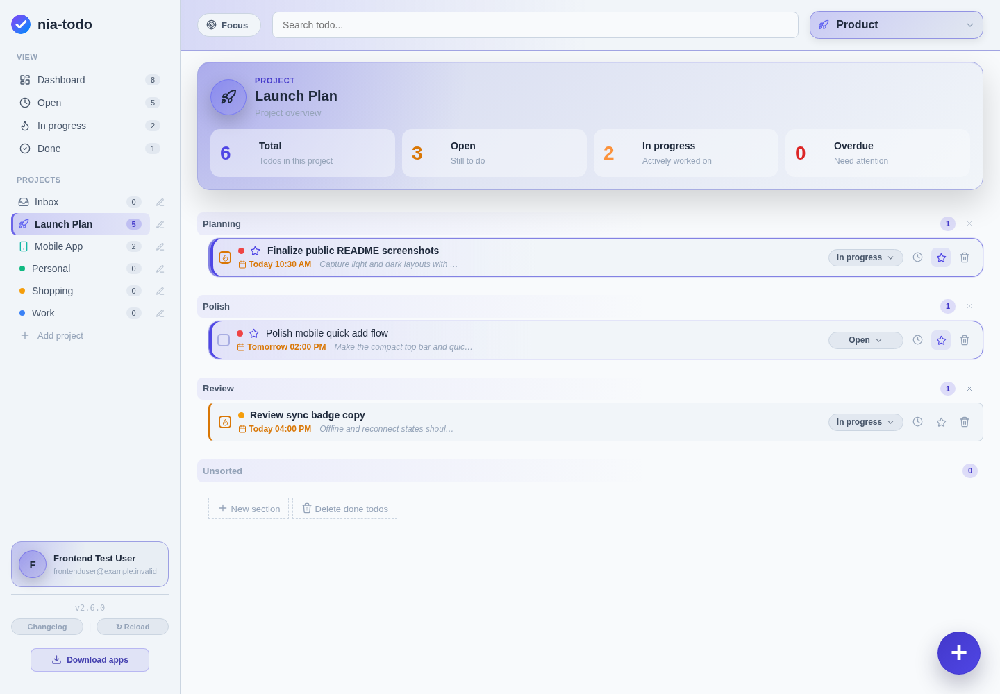
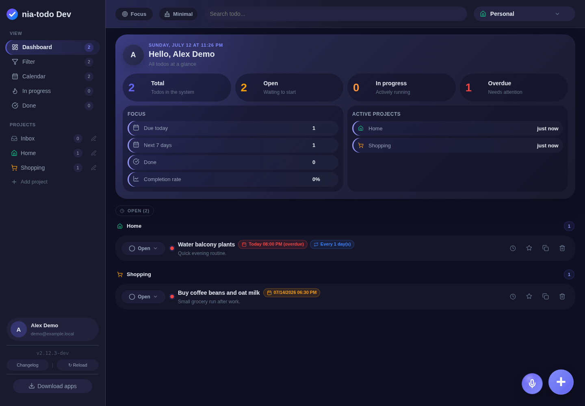
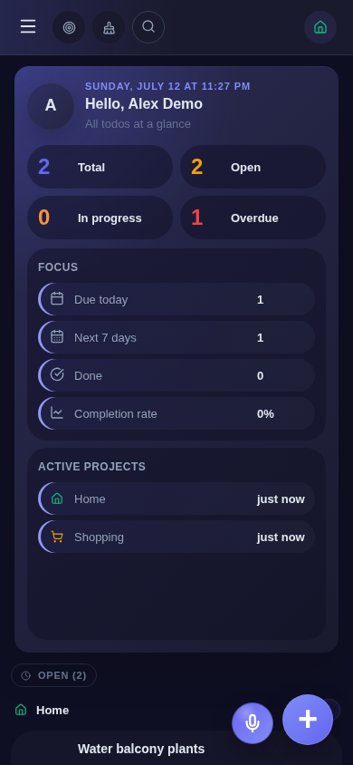

#  nia-todo

Self-hosted todo system — SQLite + FastAPI + Web UI + offline PWA + native Windows/Android clients.

nia-todo is designed for private self-hosting: install the server, open the web app, then download the bundled native apps directly from your own instance.

## 📸 Screenshots

<p align="center">
  
  
</p>
<p align="center"><em>Desktop web app — light and dark theme</em></p>

<p align="center">
  
  &nbsp;&nbsp;
  
</p>
<p align="center"><em>Mobile/PWA layout — light and dark theme</em></p>

## ✨ Features

- 📝 Todos with description, priority, deadline, status, and reminders
- 📁 Projects/categories with subprojects, sections, workspaces, and protected per-user inboxes
- 🤝 Project sharing between users with invitations and undo
- 📧 Email/SMTP integration for invitations, password reset, and email verification
- 📱 Offline-capable PWA with local IndexedDB sync queue
- 🖥️ Native Windows app wrapper
- 🤖 Native Android APK
- 🔐 Auth, admin panel, API keys, CSRF protection, and per-user data isolation
- 🛡️ 2FA/MFA with TOTP, passkeys/WebAuthn, email-code fallback, recovery codes, trusted devices, and admin policy
- 🔔 Native local reminders on Windows and Android; browser/PWA push remains browser/PWA-only
- 🎨 Theme toggle and English/German UI language support
- 🗄️ Local SQLite database

## 📦 Release artifacts

Public releases provide these main distribution targets:

- **Full server bundle**: `nia-todo-server-vX.Y.Z-full.deb`
  - installs/updates the server
  - includes the Web/PWA frontend
  - includes bundled native app downloads under `/downloads/`
- **Docker image**: for container-based installations

The Windows and Android clients are shipped inside the server bundle so your own instance can serve them locally from `/downloads/`.

## 🚀 Debian/Ubuntu installation

Download the full server bundle from the release page, then install it:

```bash
sudo apt install ./nia-todo-server-vX.Y.Z-full.deb
```

The package enables and starts the server automatically. Check it with:

```bash
sudo systemctl status nia-todo
sudo journalctl -u nia-todo -f
```

Then open the setup page in your browser and create the initial admin account:

```text
http://YOUR-SERVER:8753/setup
```

After setup, open the app at:

```text
http://YOUR-SERVER:8753/
```

The admin panel is available at:

```text
http://YOUR-SERVER:8753/admin
```

Native app downloads are served by your own instance under:

```text
http://YOUR-SERVER:8753/downloads/
```

For production use, put nia-todo behind HTTPS/reverse proxy and set the public base URL in the admin panel. Passkeys and native app integrations rely on the public URL being correct.

## 🔄 Updates

Install the newer `.deb` package over the existing installation:

```bash
sudo apt install ./nia-todo-server-vX.Y.Z-full.deb
```

The package keeps existing runtime data and creates a pre-upgrade SQLite backup when a database exists.
It also installs a daily systemd backup timer by default.

Recommended before major upgrades:

```bash
sudo systemctl stop nia-todo
sudo cp -a /var/lib/nia-todo /var/lib/nia-todo.backup.$(date +%Y%m%d-%H%M%S)
sudo apt install ./nia-todo-server-vX.Y.Z-full.deb
```

## 🐳 Docker

Run the published image directly:

```bash
docker run -d \
  --name nia-todo \
  --restart unless-stopped \
  -p 8753:8753 \
  -e NIA_TODO_HOST=0.0.0.0 \
  -e NIA_TODO_PORT=8753 \
  -e NIA_TODO_DATA_DIR=/data \
  -e NIA_TODO_DB=nia-todo.db \
  -v nia-todo-data:/data \
  ghcr.io/weedpump/nia-todo:latest
```

Or create a local `compose.yml` without cloning the source repository:

```yaml
services:
  nia-todo:
    image: ghcr.io/weedpump/nia-todo:latest
    ports:
      - "8753:8753"
    environment:
      NIA_TODO_HOST: 0.0.0.0
      NIA_TODO_PORT: 8753
      NIA_TODO_DATA_DIR: /data
      NIA_TODO_DB: nia-todo.db
    volumes:
      - nia-todo-data:/data

volumes:
  nia-todo-data:
```

Then start it:

```bash
docker compose up -d
```

Default container data volume:

```text
/data
```

## 🧱 Default package layout

- App: `/opt/nia-todo`
- Data: `/var/lib/nia-todo`
- Config: `/etc/nia-todo/nia-todo.env`
- Service: `nia-todo.service`

Useful commands:

```bash
sudo systemctl status nia-todo
sudo systemctl status nia-todo-backup.timer
sudo systemctl start nia-todo-backup.service
sudo systemctl restart nia-todo
sudo journalctl -u nia-todo -f
```

## ⚙️ Setup / operations

- Initial setup: `/setup`
- Admin panel: `/admin`
- Native app downloads: `/downloads/`
- Runtime data: `/var/lib/nia-todo`
- Configuration: `/etc/nia-todo/nia-todo.env`

For production use, configure a correct HTTPS `public_base_url` in the admin panel. Passkeys and native app integrations rely on it. Android passkeys use the bundled app signature through `/.well-known/assetlinks.json`.

## 📚 Documentation

- [API documentation](docs/api.md)
- [Architecture](docs/architecture.md)
- [Testing and release notes](docs/testing.md)
- [Changelog](CHANGELOG.md)

## 🧪 Development / source builds

The public repository is a clean source snapshot for releases. For normal self-hosting, use the release package or Docker image.

Basic local source run:

```bash
python3 -m venv .venv
. .venv/bin/activate
pip install -r requirements.txt
./start.sh
```

Frontend/native development uses the Node/Tauri tooling declared in `package.json` and `src-tauri/`.

## 🗄️ Backup

The Debian package installs an automatic daily backup timer by default:

```bash
sudo systemctl status nia-todo-backup.timer
sudo systemctl start nia-todo-backup.service
```

Manual backup:

```bash
sudo nia-todo-backup
```

Manual restore:

```bash
sudo systemctl stop nia-todo
sudo nia-todo-restore /var/lib/nia-todo/backups/nia-todo-YYYYMMDD-HHMMSS.zip
sudo systemctl start nia-todo
```

For migrating an existing install, the simplest path is:

1. Create a backup on the old install.
2. Install the new package or start the new Docker deployment.
3. Restore the backup into the new data directory.

Runtime data lives in `/var/lib/nia-todo`. It contains the SQLite database, generated keys, avatars, and local runtime data.

## 📄 License

Copyright (C) 2026 Tobias Kneidl

nia-todo is free software licensed under the GNU Affero General Public License v3.0 or later (AGPL-3.0-or-later).
See [`LICENSE`](LICENSE) and [`NOTICE`](NOTICE).
