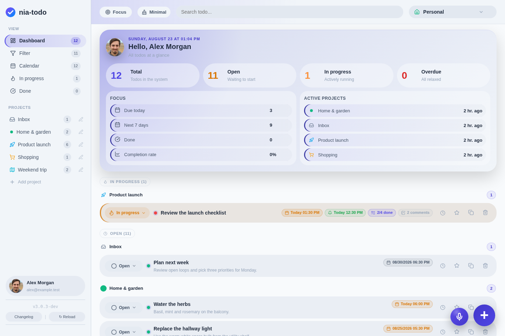
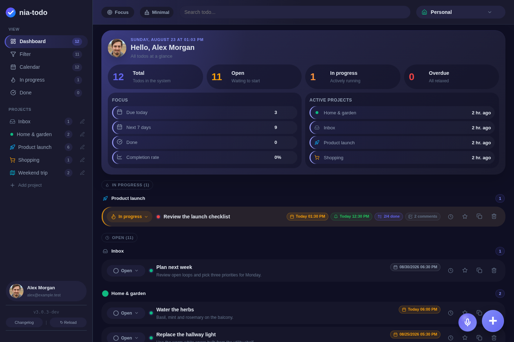

<div align="center">


# nia-todo

**Your tasks. Your server. Your data.**

A modern, self-hosted todo app with offline support, collaboration, native clients, and no external service dependency.

[](LICENSE)
[](https://github.com/weedpump/nia-todo/releases/latest)
[](https://github.com/weedpump/nia-todo/actions/workflows/tests.yml)
[](https://hub.docker.com/r/weedpump/nia-todo)


**[Website](https://nia-todo.homelabdiary.dev) · [Documentation](https://nia-todo.homelabdiary.dev/docs) · [Install](https://nia-todo.homelabdiary.dev/docs/get-started) · [Releases](https://github.com/weedpump/nia-todo/releases/latest)**

</div>

---

nia-todo keeps personal and shared work in one place while leaving you in control of the infrastructure. The FastAPI server stores its data in SQLite and serves the responsive web app, offline-capable PWA, and downloads for the bundled native clients from your own instance.

## A quick look

<p align="center">
  
  
</p>

## Highlights

- **Plan without friction.** Organize todos in projects, subprojects, sections, and workspaces; add priorities, deadlines, reminders, recurring schedules, subtasks, comments, and attachments.
- **Keep working offline.** The installable PWA caches the app shell and queues changes locally until the server is available again.
- **Share selectively.** Invite other users to individual projects while protected inboxes and per-user access controls keep private work private.
- **Use the app everywhere.** Run nia-todo in the browser or through the native Windows, Android, and Debian clients, with platform-aware notifications and reminders.
- **Sign in securely.** Built-in authentication supports TOTP, passkeys, recovery codes, trusted devices, email verification, and optional OIDC/SSO.
- **Capture ideas by voice.** The optional BrainDump workflow turns spoken notes into todo candidates using configurable local or remote STT and LLM providers.
- **Make it yours.** Choose a light or dark theme and use the interface in any of 12 supported languages.

## Languages

nia-todo is available in:

🇩🇪 **German** (`de`) · 🇬🇧 **English** (`en`) · 🇨🇿 **Czech** (`cs`) · 🇫🇷 **French** (`fr`) · 🇮🇹 **Italian** (`it`) · 🇳🇱 **Dutch** (`nl`) · 🇵🇱 **Polish** (`pl`) · 🇧🇷 **Brazilian Portuguese** (`pt-BR`) · 🇷🇺 **Russian** (`ru`) · 🇸🇪 **Swedish** (`sv`) · 🇪🇸 **Spanish** (`es`) · 🇨🇳 **Simplified Chinese** (`zh-CN`)

## Install

The recommended way to run nia-todo is with **Docker**:

```bash
docker run -d \
  --name nia-todo \
  --restart unless-stopped \
  -p 8753:8753 \
  -e NIA_TODO_HOST=auto \
  -e NIA_TODO_PORT=8753 \
  --read-only \
  --tmpfs /tmp \
  --cap-drop ALL \
  --security-opt no-new-privileges:true \
  -v nia-todo-data:/data \
  docker.io/weedpump/nia-todo:latest
```

Open `http://YOUR-SERVER:8753/setup` and create the initial admin account. For production, place the app behind HTTPS and set its public base URL in the admin panel.

A full **Debian/Ubuntu package** with systemd integration and built-in updates is available from [Releases](https://github.com/weedpump/nia-todo/releases/latest). Detailed guides cover both installation methods:

**[Docker guide](https://nia-todo.homelabdiary.dev/docs/install/docker) · [Debian/Ubuntu guide](https://nia-todo.homelabdiary.dev/docs/install/debian)**

## Documentation

Installation, configuration, native apps, backups, updates, security, and troubleshooting are covered in the documentation:

**[nia-todo.homelabdiary.dev/docs](https://nia-todo.homelabdiary.dev/docs)**

Developer references stay with the source:

- [Architecture](docs/architecture.md)
- [API documentation](docs/api.md)
- [Testing](docs/testing.md)
- [Release workflow](docs/workflow.md)
- [Changelog](CHANGELOG.md)

## Contributing

Bug reports, feature ideas, translations, and pull requests are welcome. See [CONTRIBUTING.md](CONTRIBUTING.md) for the development setup, source builds, coding conventions, and contribution workflow.

## License

nia-todo is free software licensed under the [GNU Affero General Public License v3.0 or later](LICENSE). See [NOTICE](NOTICE) for additional attribution and legal notices.

Copyright (C) 2026 Tobias Kneidl
