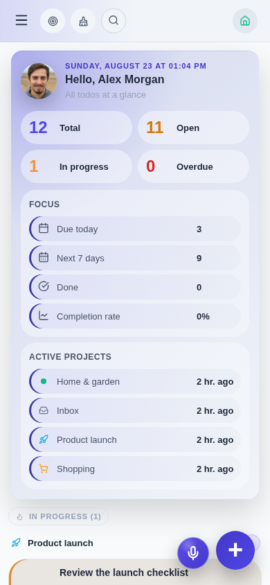
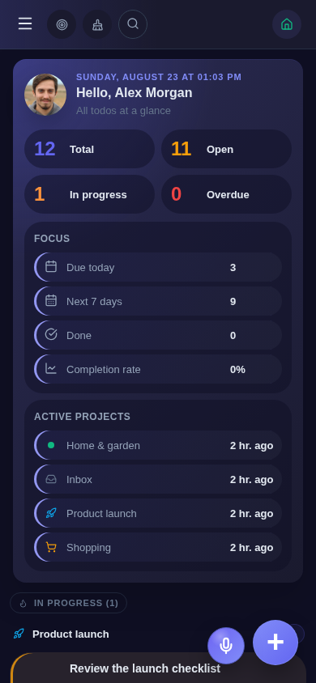

#  nia-todo

> **Note (2026-08-21):** Development has moved from a private Forgejo server to GitHub. The `main`/`develop` history was replaced accordingly, so commit count and history shape changed on this date. Existing releases and tags are unaffected.

Self-hosted todo system — SQLite + FastAPI + Web UI + offline PWA + native Windows/Android/Debian clients.

nia-todo is designed for private self-hosting: install the server, open the web app, then download the bundled native apps directly from your own instance.

🌐 **[nia-todo.homelabdiary.dev](https://nia-todo.homelabdiary.dev)** — website, screenshots, and full documentation.

## 📸 Screenshots

<p align="center">
  
  
</p>
<p align="center"><em>Desktop web app — light and dark theme</em></p>

<p align="center">
  
  &nbsp;&nbsp;
  
</p>
<p align="center"><em>Mobile/PWA layout — light and dark theme</em></p>

## ✨ Features

- 📝 Todos with rich descriptions, status, priority, deadline, reminders, recurring schedules, checklist subtasks, comments, and attachments
- ✅ Checklist-style subtasks with progress chips, parent-complete confirmation, realtime sync, and recurring-todo carry-over
- 💬 Todo comments with author display, edit/delete actions, shared-project permissions, and realtime updates
- 📎 Todo attachments with authenticated uploads/downloads, image/PDF preview, native download handling, quotas, file-type controls, and backup/restore coverage
- 🔁 Recurring todos with daily, weekly, monthly, or yearly intervals; completing one creates the next occurrence and carries compatible reminders/subtasks forward
- 📅 Calendar sidebar view with day, week, and month modes for due todos
- 📁 Projects/categories with subprojects, sections, workspaces, protected per-user inboxes, curated icons/colors, and sidebar drag-and-drop todo moves
- 🤝 Project sharing between users with invitations, undo, member management, and shared-project access checks
- 📧 Email/SMTP integration for invitations, password reset, and email verification
- 📱 Offline-capable PWA with local IndexedDB sync queue and offline app-shell precache coverage
- 🖥️ Native Windows app wrapper
- 🤖 Native Android APK
- 🐧 Native Debian desktop app wrapper with autostart, tray/global-hotkey settings, OIDC return handling, desktop notifications, and cache cleanup
- 🔐 Auth, admin panel, API keys, CSRF protection, OIDC/SSO, and per-user data isolation
- 🛡️ 2FA/MFA with TOTP, passkeys/WebAuthn, email-code fallback, recovery codes, trusted devices, and admin policy
- 🔔 Native local reminders on Windows and Android, plus Debian desktop notifications; browser/PWA push remains browser/PWA-only
- 🎙️ BrainDump voice capture for turning spoken notes into reviewed todo candidates, backed by configurable STT/LLM providers
- 🎨 Next UI refresh with polished light/dark themes, shared modal/form primitives, Lucide icons, and responsive mobile/desktop layouts
- 🆕 Localized “What’s new” release tour with per-user seen state
- 🌐 12 UI languages with localized app UI, system emails, release-tour content, native/OIDC handoff screens, and locale-aware dates/times
- 🗄️ Local SQLite database with packaged runtime-data backups

## 🌐 Supported languages

nia-todo currently supports:

- German (`de`)
- English (`en`)
- Czech (`cs`)
- French (`fr`)
- Italian (`it`)
- Dutch (`nl`)
- Polish (`pl`)
- Brazilian Portuguese (`pt-BR`)
- Russian (`ru`)
- Swedish (`sv`)
- Spanish (`es`)
- Simplified Chinese (`zh-CN`)

Language support covers the web/native UI, system emails, and release-tour content.

## 🔁 Recurring todos

Todos can be configured to repeat daily, weekly, monthly, or yearly with a custom interval. A recurring todo requires a due date; when the current occurrence is completed, nia-todo keeps it done and creates the next pending occurrence automatically. Existing reminders move forward with the same recurrence rhythm when possible.

## 📅 Calendar

The Calendar sidebar view shows due todos in day, week, and month modes. Day and week views use a timeline-style layout, while mobile month mode focuses on a selected day list for compact screens. Calendar interactions reuse the normal todo actions, so opening, editing, completing, and navigating todos works consistently across list and calendar views.

## ✅ Subtasks, comments, and attachments

Todo detail now supports checklist subtasks, comments, and attachments in one reviewable workflow:

- checklist subtasks can be created, reordered, completed independently, and carried into recurring follow-up todos
- comments support author display, edit/delete permissions, shared-project access, and realtime updates
- attachments are stored server-side with authenticated access, image/PDF previews, native download handling, quota/type enforcement, and backup/restore coverage

Admins can enable uploads globally, restrict allowed extensions, set the default storage quota, and override quota per user.

## 🎙️ BrainDump

BrainDump is an optional voice-capture workflow for turning natural spoken notes into todo candidates that the user reviews before creation. It is disabled by default and must be enabled by an admin.

Supported provider styles include:

- remote or local STT endpoints compatible with whisper.cpp-style transcription APIs
- OpenAI-compatible LLM endpoints such as LM Studio
- Ollama API endpoints, including local Ollama and Ollama Cloud
- OpenClaw's OpenAI-compatible gateway using an agent model such as `openclaw/braindump`

Admins configure BrainDump in `/admin`, test provider connectivity there, enable the global feature, and then grant access per user. Native desktop apps, the Android app, and the desktop web app can use the microphone workflow when the underlying platform grants microphone permission.

## 🆕 What's new tour and Next UI

Releases can show a localized “What's new” tour after users sign in. The tour tracks seen state per user and is precached for offline/PWA use.

The refreshed Next UI uses shared detail-modal, button, field, dropdown, icon, and navigation primitives across the app and admin panel. The result is a calmer, more consistent responsive interface across desktop, tablet, mobile, PWA, and native shells.

## 📦 Release artifacts

Public releases provide these main distribution targets:

- **Full server bundle**: `nia-todo-server-vX.Y.Z-full.deb`
  - installs/updates the server
  - includes the Web/PWA frontend
  - includes bundled native app downloads under `/downloads/`
- **Docker images**: for container-based installations via Docker Hub or GHCR

The Windows, Android, and Debian desktop clients are shipped inside the server bundle so your own instance can serve them locally from `/downloads/`.

Bundled native client filenames use the shared release version:

- `nia-todo-vX.Y.Z-windows-x64-setup.exe`
- `nia-todo-vX.Y.Z-android-arm64.apk`
- `nia-todo-desktop-vX.Y.Z-debian-amd64.deb`

## 🚀 Getting started

Full installation, configuration, and operations instructions live on the website — this keeps one authoritative copy instead of duplicating steps that drift out of sync:

- **[Docker](https://nia-todo.homelabdiary.dev/docs/install/docker)** — recommended for most self-hosters and container platforms
- **[Debian/Ubuntu package](https://nia-todo.homelabdiary.dev/docs/install/debian)** — systemd service, backup timer, in-app updates
- **[Get started](https://nia-todo.homelabdiary.dev/docs/get-started)** — compare both options and finish initial setup
- **[HTTPS / reverse proxy](https://nia-todo.homelabdiary.dev/docs/configure/reverse-proxy)**, **[Administration](https://nia-todo.homelabdiary.dev/docs/configure/administration)**, **[Security, 2FA & OIDC](https://nia-todo.homelabdiary.dev/docs/configure/security)**
- **[Backup & restore](https://nia-todo.homelabdiary.dev/docs/operations/backups)**, **[Updates](https://nia-todo.homelabdiary.dev/docs/operations/updates)**, **[Troubleshooting](https://nia-todo.homelabdiary.dev/docs/troubleshooting)**

Quick start for the impatient:

```bash
# Docker
docker run -d --name nia-todo --restart unless-stopped \
  -p 8753:8753 -e NIA_TODO_HOST=auto -e NIA_TODO_PORT=8753 \
  -v nia-todo-data:/data docker.io/weedpump/nia-todo:latest

# Debian/Ubuntu
sudo apt install ./nia-todo-server-vX.Y.Z-full.deb
```

Then open `http://YOUR-SERVER:8753/setup` to create the initial admin account. For production use, put nia-todo behind HTTPS and set the public base URL in the admin panel — passkeys and native app integrations rely on it.

## 📚 Documentation

**User documentation** (install, configure, operate, native apps) lives on the [website](https://nia-todo.homelabdiary.dev/docs) — see "Getting started" above.

**Developer documentation** stays close to the source:

- [API documentation](docs/api.md)
- [Architecture](docs/architecture.md)
- [Design concept](docs/design-concept.md)
- [Testing](docs/testing.md)
- [Workflow / release process](docs/workflow.md)
- [Changelog](CHANGELOG.md)

## 🧪 Development / source builds

For normal self-hosting, use the release package or Docker image above. To build from source or contribute, see [CONTRIBUTING.md](CONTRIBUTING.md).

## 📄 License

Copyright (C) 2026 Tobias Kneidl

nia-todo is free software licensed under the GNU Affero General Public License v3.0 or later (AGPL-3.0-or-later).
See [`LICENSE`](LICENSE) and [`NOTICE`](NOTICE).
